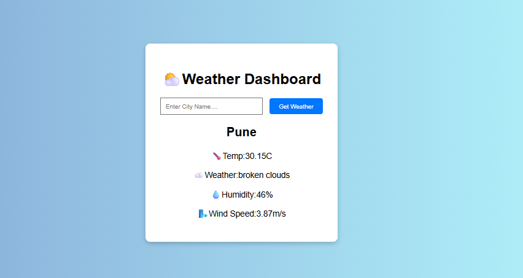

# 🌤️ Weather Dashboard

This is a simple weather dashboard web application built using **HTML**, **CSS**, and **JavaScript**. It allows users to enter a city name and get the current weather information using the **OpenWeatherMap API**.

---

## 🚀 Features

- Search for any city
- Get real-time weather data
- Displays:
  - Temperature 🌡️
  - Weather description ☁️
  - Humidity 💧
  - Wind speed 🌬️
- Clear input after search
- Responsive and clean UI

---

## 📸 Demo Screenshot



---

## 🌐 Live Demo

🔗 [Click here to view live](https://polite-squirrel-87deeb.netlify.app/)


---

## 🧰 Tech Stack

- HTML5
- CSS3
- JavaScript (Vanilla)
- OpenWeatherMap API

---

## 🔑 How to Get an API Key

1. Go to [OpenWeatherMap](https://openweathermap.org/)
2. Sign up for a free account
3. Go to your profile > API Keys
4. Copy your API key and replace `"YOUR_API_KEY"` in `script.js`

---

## 📦 How to Run Locally

```bash
git clone https://github.com/your-username/weather-dashboard.git
cd weather-dashboard
# Open index.html in your browser
